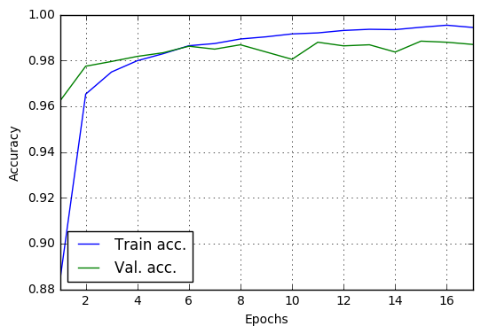

```python
import numpy as np
np.random.seed(43)
import pandas as pd
import matplotlib.pyplot as plt
%matplotlib inline
import progressbar
import pickle

from keras.models import Sequential
from keras.layers import Convolution2D, MaxPooling2D
from keras.layers import Dense, Flatten, Dropout
from keras.utils.np_utils import to_categorical
from keras.utils.visualize_util import plot
```

    Using TensorFlow backend.


## Load the data


```python
# Load the data
X_train = np.load('./X_train.npy')
X_test = np.load('./X_test.npy')
y_train = np.load('./y_train.npy')
```

## Define the model and Train


```python
# Shuffle the training data before training
shuffle_i = np.arange(len(X_train))
np.random.shuffle(shuffle_i)
X_train = X_train[shuffle_i]
y_train = y_train[shuffle_i]

# Define the model
model = Sequential()
model.add(Convolution2D(6,5,5, border_mode='same', input_shape=(28,28,1), activation='relu'))
model.add(MaxPooling2D(pool_size=(2,2)))
model.add(Convolution2D(16,5,5, border_mode='same', activation='relu'))
model.add(MaxPooling2D(pool_size=(2,2)))
# Flatten
model.add(Flatten())
# Fully Connected Layer
model.add(Dropout(0.15))
model.add(Dense(output_dim=120, activation='relu'))
model.add(Dense(output_dim=80, activation='relu'))
model.add(Dense(output_dim=10, activation='softmax'))

# Define the optimizer and the loss function
model.compile(loss='categorical_crossentropy', optimizer='adam', metrics=['accuracy'])

# Fit the model
y_train = to_categorical(y_train)
hist = model_hist = model.fit(X_train, y_train, batch_size=128, nb_epoch=17, validation_split=0.15)
```

    Train on 35700 samples, validate on 6300 samples
    Epoch 1/17
    35700/35700 [==============================] - 16s - loss: 0.3941 - acc: 0.8836 - val_loss: 0.1242 - val_acc: 0.9622
    Epoch 2/17
    35700/35700 [==============================] - 16s - loss: 0.1111 - acc: 0.9653 - val_loss: 0.0810 - val_acc: 0.9775
    Epoch 3/17
    35700/35700 [==============================] - 16s - loss: 0.0797 - acc: 0.9749 - val_loss: 0.0751 - val_acc: 0.9795
    Epoch 4/17
    35700/35700 [==============================] - 16s - loss: 0.0631 - acc: 0.9799 - val_loss: 0.0617 - val_acc: 0.9817
    Epoch 5/17
    35700/35700 [==============================] - 15s - loss: 0.0530 - acc: 0.9829 - val_loss: 0.0589 - val_acc: 0.9833
    Epoch 6/17
    35700/35700 [==============================] - 15s - loss: 0.0425 - acc: 0.9864 - val_loss: 0.0508 - val_acc: 0.9862
    Epoch 7/17
    35700/35700 [==============================] - 16s - loss: 0.0377 - acc: 0.9874 - val_loss: 0.0471 - val_acc: 0.9849
    Epoch 8/17
    35700/35700 [==============================] - 17s - loss: 0.0317 - acc: 0.9894 - val_loss: 0.0486 - val_acc: 0.9868
    Epoch 9/17
    35700/35700 [==============================] - 16s - loss: 0.0275 - acc: 0.9903 - val_loss: 0.0519 - val_acc: 0.9837
    Epoch 10/17
    35700/35700 [==============================] - 15s - loss: 0.0250 - acc: 0.9916 - val_loss: 0.0676 - val_acc: 0.9805
    Epoch 11/17
    35700/35700 [==============================] - 15s - loss: 0.0233 - acc: 0.9920 - val_loss: 0.0440 - val_acc: 0.9879
    Epoch 12/17
    35700/35700 [==============================] - 16s - loss: 0.0204 - acc: 0.9931 - val_loss: 0.0463 - val_acc: 0.9863
    Epoch 13/17
    35700/35700 [==============================] - 17s - loss: 0.0193 - acc: 0.9936 - val_loss: 0.0443 - val_acc: 0.9868
    Epoch 14/17
    35700/35700 [==============================] - 19s - loss: 0.0183 - acc: 0.9934 - val_loss: 0.0599 - val_acc: 0.9837
    Epoch 15/17
    35700/35700 [==============================] - 19s - loss: 0.0157 - acc: 0.9945 - val_loss: 0.0396 - val_acc: 0.9884
    Epoch 16/17
    35700/35700 [==============================] - 19s - loss: 0.0139 - acc: 0.9954 - val_loss: 0.0448 - val_acc: 0.9879
    Epoch 17/17
    35700/35700 [==============================] - 21s - loss: 0.0152 - acc: 0.9944 - val_loss: 0.0477 - val_acc: 0.9870


## Analyze the training result


```python
hist_data = hist.history
fig = plt.figure()
plt.plot(np.array(hist.epoch)+1, hist_data['acc']);
plt.plot(np.array(hist.epoch)+1,hist_data['val_acc']);
plt.legend(['Train acc.', 'Val. acc.'], loc='best')
plt.xlabel('Epochs'); plt.ylabel('Accuracy'); plt.grid('on')
lim = plt.xlim([1, len(hist.epoch)])
```





## Predict the test data and create submission file


```python
y_predicted = model.predict(X_test)
```


```python
# Convert it into one-dimensional array by choosing the max of each row
y_pred = []
for row in y_predicted:
    y_pred.append(np.argmax(row))
y_pred = np.array(y_pred)
```


```python
# Load the example submission and replace the column with predictions
sub_file = pd.read_csv('./sample_submission.csv')
sub_file['Label'] = y_pred
sub_file.to_csv('./sub2.csv', index=False)
```


```python

```
