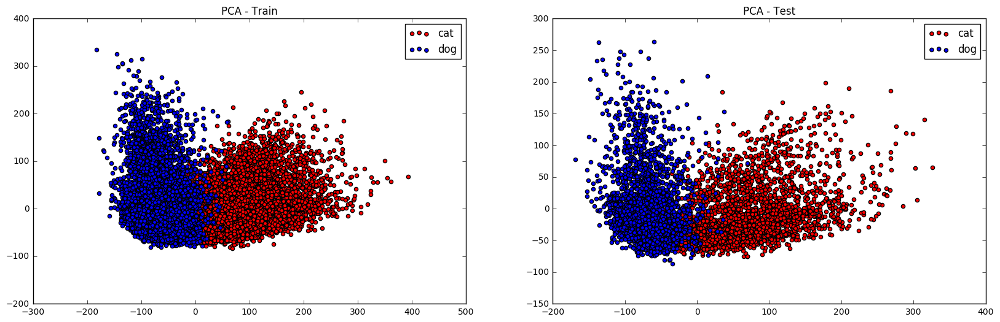

# Extract Features from VGG16net and Classify

####  Here is my work on Dogs vs. Cats dataset from Kaggle. https://www.kaggle.com/c/dogs-vs-cats-redux-kernels-edition  
* I used pre-trained VGG16net as feature extractor, obtained 4096 dimensional vectors for each image and then applied various classifiers to get a good score.
* So far, I got the best score by applying Xgboost. This method gave 0.06846 log_loss, which makes top 10% ranking in Kaggle for now.

---

**Sections:**

* [Extract Features from VGG16](#extract-features-from-vgg16)  
* [Classification](#classification)
  1. [kNN](#1-knn)  
  2. [Logistic Regression](#2-logistic-regression)  
  3. [SVM](#3-svm)  
  4. [PCA and SVM](#4-pca-and-svm)  
  5. [LDA and SVM](#5-lda-and-svm)
  6. [LDA and Logistic Regression](#6-lda-and-logistic-regression)
  7. [Fully Connected Neural Net](#7-fully-connected-neural-net)
  8. [Random Forest](#8-random-forest)
  9. [Xgboost](#9-xgboost)

## Extract Features from VGG16


```python
import numpy as np
np.random.seed(43)
from keras_dl_models.vgg16 import VGG16
from keras.preprocessing import image
from keras_dl_models.imagenet_utils import preprocess_input
from keras.models import Model, Sequential
from keras.layers import Input, Dense, Dropout, Activation
from keras.utils.np_utils import to_categorical
from keras.layers import advanced_activations
from skimage import io, transform
# Classifiers
from sklearn import svm
from sklearn import cross_validation
from sklearn.ensemble import RandomForestClassifier
from sklearn.neighbors import KNeighborsClassifier
from sklearn.linear_model import LogisticRegression
from sklearn import metrics
from sklearn.discriminant_analysis import LinearDiscriminantAnalysis
from sklearn.decomposition import PCA
import xgboost as xgb
# Preprocessing 
from sklearn.preprocessing import StandardScaler
import pandas as pd
import matplotlib.pyplot as plt
%matplotlib inline

# Constants
DL_NET_INPUT_SHAPE = (224, 224)
```

    Using TensorFlow backend.
    /home/ubuntu/anaconda2/lib/python2.7/site-packages/sklearn/cross_validation.py:44: DeprecationWarning: This module was deprecated in version 0.18 in favor of the model_selection module into which all the refactored classes and functions are moved. Also note that the interface of the new CV iterators are different from that of this module. This module will be removed in 0.20.
      "This module will be removed in 0.20.", DeprecationWarning)


```python
# Load the data
X_train = np.load('./dataset/X_train.npy')
X_test = np.load('./dataset/X_test.npy')
y_train = np.load('./dataset/y_train.npy')

print 'X_train.shape:', X_train.shape
print 'X_test.shape:', X_test.shape
print 'y_train.shape:', y_train.shape
```


```python
# Load the model
base_model = VGG16(weights='imagenet')
feature_extractor_model = Model(input=base_model.input, output=base_model.get_layer('fc1').output)

# Define feature extraction function
def get_features(im, model):
    im = transform.resize(im, output_shape=DL_NET_INPUT_SHAPE) * 255.0
    im = im.astype(np.float32)
    im = np.expand_dims(im, axis=0)
    im = preprocess_input(im)
    features = model.predict(im)
    
    return np.squeeze(features, axis=0)
```

    K.image_dim_ordering: tf


```python
# Extract features from Dnet
# Train
c = 0
X_train_f = []
for im in X_train:
    if c % 1000 == 0:
        print 'c:', c, '. '
    f = get_features(im, feature_extractor_model)
    X_train_f.append(f)
    c += 1
X_train_f = np.array(X_train_f)
np.save('./dataset/X_train_fc1.npy', X_train_f)
print 'X_train_fc1.shape:', X_train_f.shape
print ''

# Test
c = 0
X_test_f = []
for im in X_test:
    if c % 1000 == 0:
        print 'c:', c, '. '
    f = get_features(im, feature_extractor_model)
    X_test_f.append(f)
    c += 1
X_test_f = np.array(X_test_f)
np.save('./dataset/X_test_fc1.npy', X_test_f)
print 'X_test_fc1.shape:', X_test_f.shape
```

    X_train_f.shape: (25000, 4096)
    

    X_test_f.shape: (12500, 4096)


## Classification

1. [kNN](#1-knn)  
2. [Logistic Regression](#2-logistic-regression)  
3. [SVM](#3-svm)  
4. [PCA and SVM](#4-pca-and-svm)  
5. [LDA and SVM](#5-lda-and-svm)
6. [LDA and Logistic Regression](#6-lda-and-logistic-regression)
7. [Fully Connected Neural Net](#7-fully-connected-neural-net)
8. [Random Forest](#8-random-forest)


```python
# Load the dataset
X_train_f = np.load('./dataset/X_train_fc1.npy')
X_test_f = np.load('./dataset/X_test_fc1.npy')
y_train = np.load('./dataset/y_train.npy')

print 'X_train_f.shape:', X_train_f.shape
print 'X_test_f.shape:', X_test_f.shape
print 'y_train.shape:', y_train.shape
```

    X_train_f.shape: (25000, 4096)
    X_test_f.shape: (12500, 4096)
    y_train.shape: (25000,)


### 1. kNN


```python
# Cross_validation
skf = cross_validation.StratifiedKFold(y_train, n_folds=5, shuffle=True)
cv_scores = []
cv_counter = 0
for train_index, val_index in skf:
    print 'cv_counter:', cv_counter, '. ',
    # Define the model
    model_knn = KNeighborsClassifier(n_neighbors=5)
    # Fit the model on train        
    model_knn.fit(X_train_f[train_index], y_train[train_index]); 
    # Predict
    y_val_p = model_knn.predict_proba(X_train_f[val_index])[:,1]; 
    # Get score
    score = metrics.log_loss(y_train[val_index], y_val_p);
    cv_scores.append(score)
    cv_counter += 1
print ''
print 'cv_scores:', cv_scores
print 'np.mean(cv_scores):', np.mean(cv_scores)
```

    cv_counter: 0 .  cv_counter: 1 .  cv_counter: 2 .  cv_counter: 3 .  cv_counter: 4 .  
    cv_scores: [0.25925423481084053, 0.21243307348418525, 0.21382981939863915, 0.18908801317412077, 0.21660753704836444]
    np.mean(cv_scores): 0.218242535583


### 2. Logistic Regression


```python
# Cross_validation
skf = cross_validation.StratifiedKFold(y_train, n_folds=5, shuffle=True)
cv_scores = []
cv_counter = 0
for train_index, val_index in skf:
    print 'cv_counter:', cv_counter, '. ',
    # Define the model
    model_lr = LogisticRegression(penalty='l1')
    # Fit the model on train        
    model_lr.fit(X_train_f[train_index], y_train[train_index]); 
    # Predict
    y_val_p = model_lr.predict_proba(X_train_f[val_index])[:,1]; 
    # Get score
    score = metrics.log_loss(y_train[val_index], y_val_p);
    cv_scores.append(score)
    cv_counter += 1
print ''
print 'cv_scores:', cv_scores
print 'np.mean(cv_scores):', np.mean(cv_scores)
```

    cv_counter: 0 .  cv_counter: 1 .  cv_counter: 2 .  cv_counter: 3 .  cv_counter: 4 .  
    cv_scores: [0.062534632772838397, 0.049061279127136655, 0.050302614518137251, 0.050662534636204133, 0.066009166471878433]
    np.mean(cv_scores): 0.0557140455052


```python
# -- Submission --
# Make the model, fit, predict
X_train, X_test, y_train  = X_train_f, X_test_f, y_train
model_lr = LogisticRegression(penalty='l1')
model_lr.fit(X_train, y_train)
y_test_p = model_lr.predict_proba(X_test)[:,1]
print 'y_test_p.shape:', y_test_p.shape
# Create submission file
id_column = range(1, len(y_test_p)+1)
predictions_column = y_test_p
#
df = pd.DataFrame()
df['id'] = id_column
df['label'] = predictions_column
#
h = df.to_csv('./submission_files/kg_dogcat_sub5.csv', index = False)
```

    y_test_p.shape: (12500,)


### 3. SVM


```python
X_train_, X_test_, y_train_, y_test_ = cross_validation.train_test_split(X_train_f, y_train, test_size=0.2)
model_svm = svm.SVC(kernel='linear', probability=True)
model_svm.fit(X_train_, y_train_)
# Predict
y_train_p = model_svm.predict_proba(X_train_)[:,1]
y_test_p = model_svm.predict_proba(X_test_)[:,1]
# Scores
score_train = metrics.log_loss(y_train_, y_train_p);
score_test = metrics.log_loss(y_test_, y_test_p);

print 'score_train:', score_train
print 'score_test:', score_test
```

    score_train: 0.0102282149741
    score_test: 0.0524092035672


```python
# Cross-validation
skf = cross_validation.StratifiedKFold(y_train, n_folds=5, shuffle=True)
cv_scores = []
cv_counter = 0
for train_index, val_index in skf:
    print 'cv_counter:', cv_counter, '. ',
    # Define the model
    model_svm = svm.SVC(kernel='linear', probability=True)
    # Fit the model on train        
    X_train_, y_train_ = np.copy(X_train_f[train_index]), y_train[train_index]
    std_scaler = StandardScaler()
    X_train_ = std_scaler.fit_transform(X_train_)
    model_svm.fit(X_train_, y_train_); 
    # Predict
    X_val_ = std_scaler.transform(X_train_f[val_index]);
    y_val_p = model_svm.predict_proba(X_val_)[:,1]; 
    # Get score
    score = metrics.log_loss(y_train[val_index], y_val_p);
    cv_scores.append(score)
    cv_counter += 1
print ''
print 'cv_scores:', cv_scores
print 'np.mean(cv_scores):', np.mean(cv_scores)
```

    cv_counter: 0 .  cv_counter: 1 .  cv_counter: 2 .  cv_counter: 3 .  cv_counter: 4 .  
    cv_scores: [0.071326753608035573, 0.062132320041241383, 0.056556933289615106, 0.04962579220763385, 0.057778859144555279]
    np.mean(cv_scores): 0.0594841316582


```python
# -- Submission --
# Make the model, fit, predict
model_svm = svm.SVC(kernel='rbf', gamma=0.02, C=0.1, probability=True)
model_svm.fit(X, y)
X_test_f_1 = model_lda.transform(X_test_f)
y_test_p = model_svm.predict_proba(X_test_f_1)[:,1]
print 'y_test_p.shape:', y_test_p.shape
# Create submission file
id_column = range(1, len(y_test_p)+1)
predictions_column = y_test_p
#
df = pd.DataFrame()
df['id'] = id_column
df['label'] = predictions_column
#
h = df.to_csv('kg_dogcat_sub4.csv', index = False)
```


```python

```

### 4. PCA and SVM


```python
X_train_, X_test_, y_train_, y_test_ = cross_validation.train_test_split(X_train_f, y_train, test_size=0.2)
#
model_pca = PCA(n_components=2)
model_pca.fit(X_train_, y_train_)
X_train_ldim = model_pca.transform(X_train_)
X_test_ldim = model_pca.transform(X_test_)
#
fig = plt.figure();
fig.set_size_inches(20,6);
label_list = [0, 1]  # 0: cat, 1:dog
color_list = ['r', 'b']
# Train Plot
plt.subplot(1,2,1);
for color_, label_ in zip(color_list, label_list):
    X_label = X_train_ldim[y_train_ == label_]
    plt.scatter(X_label[:,0], X_label[:,1], c=color_)
plt.title('PCA - Train'); plt.legend(['cat','dog']);
# Test Plot
plt.subplot(1,2,2); 
for color_, label_ in zip(color_list, label_list):
    X_label = X_test_ldim[y_test_ == label_]
    plt.scatter(X_label[:,0], X_label[:,1], c=color_)
plt.title('PCA - Test'); plt.legend(['cat', 'dog']);
```





```python
# Cross Validation
skf = cross_validation.StratifiedKFold(y_train, n_folds=5, shuffle=True)
cv_scores = []
cv_counter = 0
for train_index, test_index in skf:
    print 'cv_counter:', cv_counter, '. ',
    X_train_, y_train_ = X_train_f[train_index], y_train[train_index]
    X_test_, y_test_ = X_train_f[test_index], y_train[test_index]
    # Define the PCA and SVM models
    model_pca = PCA(n_components=3)
    model_svm = svm.SVC(kernel='linear', probability=True)
    # Fit on training
    X_train_ = model_pca.fit_transform(X_train_)
    print 'X_train_.shape:', X_train_.shape
    model_svm.fit(X_train_, y_train_)
    # Predict
    X_test_ = model_pca.transform(X_test_)
    print 'X_test_.shape:', X_test_.shape
    y_test_p = model_svm.predict_proba(X_test_)[:,1]
    score = metrics.log_loss(y_test_, y_test_p)
    print 'score:', score
    cv_scores.append(score)
    cv_counter += 1   
print ''
print 'cv_scores:', cv_scores
print 'np.mean(cv_scores):', np.mean(cv_scores)
```

    cv_counter: 0 .  X_train_.shape: (20000, 3)
    X_test_.shape: (5000, 3)
    score: 0.11624287241
    cv_counter: 1 .  X_train_.shape: (20000, 3)


```python
# -- Submission --
# Make the model, fit, predict
X_train, X_test, y_train  = X_train_f, X_test_f, y_train
#
model_pca = PCA(n_components=2)
model_svm = svm.SVC(kernel='linear', probability=True)
#
X_train = model_pca.fit_transform(X_train)
print 'X_train.shape:', X_train.shape
model_svm.fit(X_train, y_train)
X_test = model_pca.transform(X_test)
y_test_p = model_svm.predict_proba(X_test)[:,1]
print 'y_test_p.shape:', y_test_p.shape
# Create submission file
id_column = range(1, len(y_test_p)+1)
predictions_column = y_test_p
#
df = pd.DataFrame()
df['id'] = id_column
df['label'] = predictions_column
#
h = df.to_csv('./submission_files/kg_dogcat_sub6.csv', index = False)
```

    X_train.shape: (25000, 2)
    y_test_p.shape: (12500,)


### 5. LDA and SVM


```python
X_train_lda, X_test_lda, y_train_lda, y_test_lda = cross_validation.train_test_split(X_train_f, y_train, test_size=0.2)
#
model_lda = LinearDiscriminantAnalysis(n_components=1)
# model_lda = PCA(n_components=2)
model_lda.fit(X_train_lda, y_train_lda)
X_train_1 = model_lda.transform(X_train_lda)
X_test_1 = model_lda.transform(X_test_lda)
#
fig = plt.figure();
fig.set_size_inches(20,6);
label_list = [0, 1]  # 0: cat, 1:dog
color_list = ['r', 'b']
# Train Plot
plt.subplot(1,2,1);
for color_, label_ in zip(color_list, label_list):
    X_label = X_train_1[y_train_lda == label_]
    plt.scatter(X_label[:], np.random.rand(len(X_label)), c=color_)
plt.title('Train'); plt.legend(['cat','dog']);
# Test Plot
plt.subplot(1,2,2); 
for color_, label_ in zip(color_list, label_list):
    X_label = X_test_1[y_test_lda == label_]
    plt.scatter(X_label[:], np.random.rand(len(X_label)), c=color_)
plt.title('Test'); plt.legend(['cat', 'dog']);
```


```python
# Fit linear svm
model_svm = svm.SVC(kernel='linear', probability=True)
model_svm.fit(X_train_1, y_train_lda);  print 'Fit done.'
train_predictions = model_svm.predict_proba(X_train_1)[:,1];  print 'Train Prediction Done.'
test_predictions = model_svm.predict_proba(X_test_1)[:,1];  print 'Test Prediction Done.'

train_score = metrics.log_loss(y_train_lda, train_predictions)
test_score = metrics.log_loss(y_test_lda, test_predictions)

print 'train_score:', train_score
print 'test_score:', test_score
```

    Fit done.
    Train Prediction Done.
    Test Prediction Done.
    train_score: 0.0132830835458
    test_score: 0.0765108996531


```python
# Cross-validation
skf = cross_validation.StratifiedKFold(y_train, n_folds=5, shuffle=True)
cv_scores = []
cv_counter = 0
for train_index, test_index in skf:
    print 'cv_counter:', cv_counter, '. ',
    # Define the model LDA and SVM
    model_lda = LinearDiscriminantAnalysis(n_components=1)
    model_svm = svm.SVC(kernel='linear', probability=True)
    # Fit the model on train   
    #
    X_train_, y_train_ = X_train_f[train_index], y_train[train_index]
    X_test_, y_test_ = X_train_f[test_index], y_train[test_index]
    #
    X_train_ = model_lda.fit_transform(X_train_, y_train_); 
    print 'X_train_.shape:', X_train_.shape     
    model_svm.fit(X_train_, y_train_); 
    # Predict
    X_test_ = model_lda.transform(X_test_)
    print 'X_test_.shape:', X_test_.shape
    y_test_p = model_svm.predict_proba(X_test_)[:,1]; 
    # Get score
    score = metrics.log_loss(y_test_, y_test_p);
    cv_scores.append(score)
    cv_counter += 1
print ''
print 'cv_scores:', cv_scores
print 'np.mean(cv_scores):', np.mean(cv_scores)
```

    cv_counter: 0 .  X_train_.shape: (20000, 1)
    X_test_.shape: (5000, 1)
    cv_counter: 1 .  X_train_.shape: (20000, 1)
    X_test_.shape: (5000, 1)
    cv_counter: 2 .  X_train_.shape: (20000, 1)
    X_test_.shape: (5000, 1)
    cv_counter: 3 .  X_train_.shape: (20000, 1)
    X_test_.shape: (5000, 1)
    cv_counter: 4 .  X_train_.shape: (20000, 1)
    X_test_.shape: (5000, 1)
    
    cv_scores: [0.1133007735965592, 0.087405874198431766, 0.076068542626020877, 0.088391843539846415, 0.10109833854994048]
    np.mean(cv_scores): 0.0932530745022


```python
# -- Submission --
# Make the model, fit, predict
model_svm = svm.SVC(kernel='rbf', gamma=0.02, C=0.1, probability=True)
model_svm.fit(X, y)
X_test_f_1 = model_lda.transform(X_test_f)
y_test_p = model_svm.predict_proba(X_test_f_1)[:,1]
print 'y_test_p.shape:', y_test_p.shape
# Create submission file
id_column = range(1, len(y_test_p)+1)
predictions_column = y_test_p
#
df = pd.DataFrame()
df['id'] = id_column
df['label'] = predictions_column
#
h = df.to_csv('kg_dogcat_sub4.csv', index = False)
```

    y_test_p.shape: (12500,)


### 6. LDA and Logistic Regression


```python
# Cross-validation
skf = cross_validation.StratifiedKFold(y_train, n_folds=5, shuffle=True)
cv_scores = []
cv_counter = 0
for train_index, test_index in skf:
    print 'cv_counter:', cv_counter, '. ',
    # Define the model LDA and Logistic Regression
    model_lda = LinearDiscriminantAnalysis(n_components=1)
    model_lr = LogisticRegression(penalty='l2', C=0.005)
    # Fit the model on train   
    #
    X_train_, y_train_ = X_train_f[train_index], y_train[train_index]
    X_test_, y_test_ = X_train_f[test_index], y_train[test_index]
    #
    X_train_ = model_lda.fit_transform(X_train_, y_train_); 
    print 'X_train_.shape:', X_train_.shape     
    model_lr.fit(X_train_, y_train_); 
    # Predict
    X_test_ = model_lda.transform(X_test_)
    print 'X_test_.shape:', X_test_.shape
    y_test_p = model_lr.predict_proba(X_test_)[:,1]; 
    # Get score
    score = metrics.log_loss(y_test_, y_test_p);
    print 'score:', score
    cv_scores.append(score)
    cv_counter += 1
print ''
print 'cv_scores:', cv_scores
print 'np.mean(cv_scores):', np.mean(cv_scores)
```

    cv_counter: 0 .  X_train_.shape: (20000, 1)
    X_test_.shape: (5000, 1)
    score: 0.0689750609748
    cv_counter: 1 .  X_train_.shape: (20000, 1)
    X_test_.shape: (5000, 1)
    score: 0.0600098077746
    cv_counter: 2 .  X_train_.shape: (20000, 1)
    X_test_.shape: (5000, 1)
    score: 0.0585074800402
    cv_counter: 3 .  X_train_.shape: (20000, 1)
    X_test_.shape: (5000, 1)
    score: 0.062012750201
    cv_counter: 4 .  X_train_.shape: (20000, 1)
    X_test_.shape: (5000, 1)
    score: 0.0655174185008
    
    cv_scores: [0.068975060974767716, 0.060009807774565091, 0.058507480040229792, 0.062012750201049661, 0.065517418500820379]
    np.mean(cv_scores): 0.0630045034983


```python
# -- Submission --
# Make the model, fit, predict
X_train, X_test, y_train  = X_train_f, X_test_f, y_train
#
model_lda = LinearDiscriminantAnalysis(n_components=1)
model_lr = LogisticRegression(penalty='l2', C=0.005)
#
X_train = model_lda.fit_transform(X_train, y_train)
print 'X_train.shape:', X_train.shape
model_lr.fit(X_train, y_train)
X_test = model_lda.transform(X_test)
y_test_p = model_lr.predict_proba(X_test)[:,1]
print 'y_test_p.shape:', y_test_p.shape
# Create submission file
id_column = range(1, len(y_test_p)+1)
predictions_column = y_test_p
#
df = pd.DataFrame()
df['id'] = id_column
df['label'] = predictions_column
#
h = df.to_csv('./submission_files/kg_dogcat_sub9.csv', index = False)
```

    X_train.shape: (25000, 1)
    y_test_p.shape: (12500,)


### 7. Fully Connected Neural Net


```python
# Train Test Split
X_train_, X_test_, y_train_, y_test_ = cross_validation.train_test_split(X_train_f, y_train, test_size=0.2)
print 'X_train_.shape:', X_train_.shape
print 'X_test_.shape:', X_test_.shape
print 'y_train_.shape:', y_train_.shape
print 'y_test_.shape:', y_test_.shape

# Preprocess
std_scaler = StandardScaler()
std_scaler.fit(X_train_)
X_train_ = std_scaler.transform(X_train_)  # Scale train
X_test_ = std_scaler.transform(X_test_)  # Scale test

#
y_train_cat = to_categorical(y_train_)

# Model
def get_model():    
    model = Sequential()
    model.add(Dense(output_dim=1000, input_dim=4096, activation='relu'))
    model.add(Dropout(0.1))
    model.add(Dense(output_dim=100, activation='relu'))
    model.add(Dense(output_dim=2, activation='softmax'))    
    return model


# Define loss function, optimizer
nn_model = get_model()
nn_model.compile(loss='categorical_crossentropy', optimizer='adam', metrics=['accuracy'])

# Fit 
model_hist = nn_model.fit(X_train_, y_train_cat, batch_size=128, nb_epoch=5)
```

    X_train.shape: (20000, 4096)
    X_test.shape: (5000, 4096)
    y_train.shape: (20000,)
    y_test.shape: (5000,)
    Epoch 1/5
    20000/20000 [==============================] - 5s - loss: 0.0779 - acc: 0.9781     
    Epoch 2/5
    20000/20000 [==============================] - 1s - loss: 0.0217 - acc: 0.9938     
    Epoch 3/5
    20000/20000 [==============================] - 1s - loss: 0.0098 - acc: 0.9978     
    Epoch 4/5
    20000/20000 [==============================] - 1s - loss: 0.0058 - acc: 0.9985     
    Epoch 5/5
    20000/20000 [==============================] - 1s - loss: 0.0049 - acc: 0.9987     


```python
y_train_p = nn_model.predict_proba(X_train_)[:,1]
y_test_p = nn_model.predict_proba(X_test_)[:,1]

y_train_ = y_train_.astype(np.float64)
y_test_ = y_test_.astype(np.float64)
y_train_p = y_train_p.astype(np.float64)
y_test_p = y_test_p.astype(np.float64)

print ''
print '(train)mae:', metrics.mean_absolute_error(y_train_, y_train_p)
print '(test)mae:',metrics.mean_absolute_error(y_test_, y_test_p)

print ''
print '(train)log_loss:', metrics.log_loss(y_train_, y_train_p)
print '(test)log_loss:', metrics.log_loss(y_test_, y_test_p)
```

    20000/20000 [==============================] - 1s     
    5000/5000 [==============================] - 0s     
    
    (train)mae: 0.00105270190605
    (test)mae: 0.0144955715461
    (train)log_loss: 0.00369568399128
    (test)log_loss: 0.0630141921326


```python
# Model
def get_model():    
    model = Sequential()
    model.add(Dense(output_dim=1000, input_dim=4096, activation='relu'))
    model.add(Dropout(0.1))
    model.add(Dense(output_dim=100, activation='relu'))
    model.add(Dense(output_dim=2, activation='softmax'))    
    return model


# Cross-Validation
skf = cross_validation.StratifiedKFold(y_train, n_folds=5, shuffle=True)
print 'y_train.shape:', y_train.shape
cv_scores = []
cv_counter = 0
for train_index, test_index in skf:
    print 'cv_counter:', cv_counter, '. ',
    
    # Get train-test split
    X_train_, y_train_ = X_train_f[train_index], y_train[train_index]
    X_test_, y_test_ = X_train_f[test_index], y_train[test_index]   
    
    # Preprocess
    std_scaler = StandardScaler()
    std_scaler.fit(X_train_)
    X_train_ = std_scaler.transform(X_train_)
    X_test_ = std_scaler.transform(X_test_)
    
    # Define the model
    nn_model = get_model()
    nn_model.compile(loss='categorical_crossentropy', optimizer='adam', metrics=['accuracy'])
    
    # Fit the model on train   
    y_train_cat = to_categorical(y_train_)
    model_hist = nn_model.fit(X_train_, y_train_cat, batch_size=64, nb_epoch=2, verbose=0)
    print 'fit done.'
    
    # Predict
    y_test_p = nn_model.predict_proba(X_test_, verbose=0)[:,1]
    
    # Get score
    y_test_ = y_test_.astype(np.float64)
    y_test_p = y_test_p.astype(np.float64)
    score = metrics.log_loss(y_test_, y_test_p);
    print 'score:', score
    cv_scores.append(score)
    cv_counter += 1
print ''
print 'cv_scores:', cv_scores
print 'np.mean(cv_scores):', np.mean(cv_scores)
```

    y_train.shape: (25000,)
    cv_counter: 0 .  fit done.
    score: 0.0464722810983
    cv_counter: 1 .  fit done.
    score: 0.035023562622
    cv_counter: 2 .  fit done.
    score: 0.0563291125779
    cv_counter: 3 .  fit done.
    score: 0.0467098955594
    cv_counter: 4 .  fit done.
    score: 0.0503324942073
    
    cv_scores: [0.046472281098303439, 0.03502356262198035, 0.056329112577867907, 0.046709895559409458, 0.050332494207278818]
    np.mean(cv_scores): 0.046973469213


```python
# -- Submission --
# Model
def get_model():    
    model = Sequential()
    model.add(Dense(output_dim=1000, input_dim=4096, activation='relu'))
    model.add(Dropout(0.1))
    model.add(Dense(output_dim=100, activation='relu'))
    model.add(Dense(output_dim=2, activation='softmax'))    
    return model

# Get data
X_train, X_test, y_train= X_train_f, X_test_f, y_train

# Preprocess
std_scaler = StandardScaler()
std_scaler.fit(X_train)
X_train = std_scaler.transform(X_train)
X_test = std_scaler.transform(X_test)

# Get the model
nn_model = get_model()
nn_model.compile(loss='categorical_crossentropy', optimizer='adam', metrics=['accuracy'])

# Fit on train
y_train_cat = to_categorical(y_train)
model_hist = nn_model.fit(X_train, y_train_cat, batch_size=64, nb_epoch=2, verbose=0)

# Predict
y_test_p = nn_model.predict_proba(X_test)[:,1]

# Create submission file
id_column = range(1, len(y_test_p)+1)
predictions_column = y_test_p
#
df = pd.DataFrame()
df['id'] = id_column
df['label'] = predictions_column
#
h = df.to_csv('./submission_files/kg_dogcat_sub10.csv', index = False)
```

    12500/12500 [==============================] - 0s     


### 8. Random Forest


```python
# Cross-validation
model_svm = svm.SVC(kernel='linear')
model_rf = RandomForestClassifier()

skf = cross_validation.StratifiedKFold(y_train, n_folds=5, shuffle=True)
cv_scores = []
for train_index, val_index in skf:
    # Define the model
    model_rf = RandomForestClassifier(n_estimators=128)
    # Fit the model on train        
    model_rf.fit(X_train_f[train_index], y_train[train_index])
    # Predict
    y_val_p = model_rf.predict_proba(X_train_f[val_index])[:,1]
    # Get score
    score = metrics.log_loss(y_train[val_index], y_val_p)
    cv_scores.append(score)
print 'cv_scores:', cv_scores
print 'np.mean(cv_scores):', np.mean(cv_scores)
```

    cv_scores: [0.086772849399502777, 0.084260140014465884, 0.085100359631951297, 0.083225206695343598, 0.087800603979582489]
    np.mean(cv_scores): 0.0854318319442


```python
# Make the model and fit
model_rf = RandomForestClassifier(n_estimators=128)
model_rf.fit(X_train_f, y_train)
```


    RandomForestClassifier(bootstrap=True, class_weight=None, criterion='gini',
                max_depth=None, max_features='auto', max_leaf_nodes=None,
                min_samples_leaf=1, min_samples_split=2,
                min_weight_fraction_leaf=0.0, n_estimators=128, n_jobs=1,
                oob_score=False, random_state=None, verbose=0,
                warm_start=False)


```python
# Predict train
y_train_p = model_rf.predict(X_train_f)
print 'np.mean(y_train == y_train_p):', np.mean(y_train == y_train_p)

# Predict test data
y_test_p = model_rf.predict_proba(X_test_f)[:,1]
```

    np.mean(y_train == y_train_p): 1.0


```python
# Save the test predictions to file
id_column = range(1, len(y_test_p)+1)
predictions_column = y_test_p
#
df = pd.DataFrame()
df['id'] = id_column
df['label'] = predictions_column
#
h = df.to_csv('kg_dogcat_sub2.csv', index = False)
```


### 9. Xgboost


```python
skf = cross_validation.StratifiedKFold(y_train, n_folds=5, shuffle=True)
cv_scores = []
for train_index, val_index in skf:
    # Get X, y
    X_train_, y_train_ = X_train_f[train_index], y_train[train_index]
    X_test_, y_test_   = X_train_f[val_index], y_train[val_index]    
    
    # Define model
    model_xgb = xgb.XGBClassifier(max_depth=10)    
    
    # Fit the model on training data
    model_xgb.fit(X_train_, y_train_)    
    
    # Predict the test data
    y_test_p = model_xgb.predict_proba(X_test_)[:,1]   
    
    # Get the score
    score = metrics.log_loss(y_test_, y_test_p)
    print 'score:', score
    cv_scores.append(score)

print 'cv_scores:', cv_scores
print 'np.mean(cv_scores):', np.mean(cv_scores)
```

```python
# --- Submission --- 
# Define the model
model_xgb = xgb.XGBClassifier()
# Fit on train
model_xgb.fit(X_train_f, y_train)
# Predict 
y_test_p = model_xgb.predict_proba(X_test_f)[:,1]
# Create submission file
id_column = range(1, len(y_test_p)+1)
predictions_column = y_test_p
#
df = pd.DataFrame()
df['id'] = id_column
df['label'] = predictions_column
#
h = df.to_csv('../submission_files/kg_dogcat_subXGB1.csv', index = False)
print 'Done.'
```

