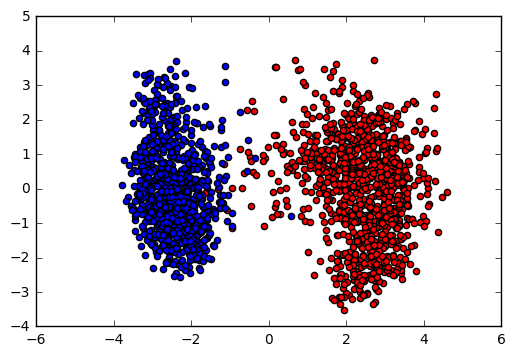

# 1. Extract Features

* [Load the Data and Get Feature Extractor Model](#Load-the-Data-and-Get-Feature-Extractor-Model)
* [Try on a small subsample of data - Sanity Check](#Try-on-a-small-subsample-of-data---Sanity-Check)


```python
import numpy as np
RANDOM_SEED = 43
np.random.seed(43)
from keras import models
from keras.applications import xception
from skimage import io, transform
from sklearn import decomposition
from sklearn import ensemble
from sklearn import linear_model
from sklearn import model_selection
import matplotlib.pyplot as plt
%matplotlib inline
```

    Using TensorFlow backend.


## Load the Data and Get Feature Extractor Model


```python
# Load the data
X_train = np.load('../dataset/X_train.npy')
print 'X_train.shape:', X_train.shape
y_train = np.load('../dataset/y_train.npy')
print 'y_train.shape:', y_train.shape
```

    X_train.shape: (25000,)
    y_train.shape: (25000,)


```python
# Get full model
full_model = xception.Xception()
# Get feature extractor model
f_model = models.Model(input=full_model.input, output=full_model.get_layer('avg_pool').output)
```

## Try on a small subsample of data - Sanity Check


```python
im = X_train[1]
im = transform.resize(im, output_shape=(299, 299)) * 255
im = np.expand_dims(im, axis=0)
print 'im.shape:', im.shape
im = xception.preprocess_input(im)
f = f_model.predict(im, verbose=1)
print 'f.shape:', f.shape
```

    im.shape: (1, 299, 299, 3)
    1/1 [==============================] - 0s
    f.shape: (1, 2048)


```python
# Subsample training data
N = 2000
random_i = np.random.choice(len(X_train), size=N, replace=False)
X_train_small = X_train[random_i]
y_train_small = y_train[random_i]
print 'X_train_small.shape:', X_train_small.shape
print 'y_train_small.shape:', y_train_small.shape

# Process 
X_train_small = np.array([transform.resize(im, output_shape=(299,299))*255.0 for im in X_train_small])
X_train_small = xception.preprocess_input(X_train_small)
print ''
print 'X_train_small.shape:', X_train_small.shape
```

    X_train_small.shape: (2000,)
    y_train_small.shape: (2000,)
    
    X_train_small.shape: (2000, 299, 299, 3)


```python
# Extract features from small subpsampled data
X = f_model.predict(X_train_small, verbose=1)
print 'X.shape:', X.shape
```

    2000/2000 [==============================] - 52s    
    X.shape: (2000, 2048)


```python
# Perform PCA
pca_model = decomposition.PCA(n_components=2, random_state=RANDOM_SEED)
pca_model.fit(X)
X_rdim = pca_model.transform(X)
print 'X_rdim.shape:', X_rdim.shape

# Plot
labels_ = [0, 1]
colors_ = ['r', 'b']
fig = plt.figure()
ax1 = fig.add_subplot(1,1,1)
for label_, color_ in zip(labels_, colors_):
    X_ = X_rdim[y_train_small == label_]
    ax1.scatter(X_[:,0], X_[:,1], c=color_)
```

    X_rdim.shape: (2000, 2)





```python
# Cross-Validation
rf_model = ensemble.RandomForestClassifier(random_state=RANDOM_SEED)
lr_model = linear_model.LogisticRegression()
cv_scores = model_selection.cross_val_score(lr_model, X_rdim, y_train_small, cv=5, scoring='neg_log_loss')
print cv_scores
```

    [-0.0421098  -0.01777339 -0.02113947 -0.02138741 -0.02816383]


## Extract Features


```python
def get_feature(im):
    im = transform.resize(im, output_shape=(299, 299)) * 255.0
    im = np.expand_dims(im, axis=0)
    im = xception.preprocess_input(im)
    return np.squeeze(f_model.predict(im))    
```

### Train


```python
counter = 0
X_train_f = []
for im in X_train:
    if counter % 100 == 0:
        print counter, 
    f = get_feature(im)
    X_train_f.append(f)
    counter += 1
X_train_f = np.array(X_train_f)
print 'X_train_f.shape:', X_train_f.shape
```

    0 100 200 300 400 500 600 700 800 900 1000 1100 1200 1300 1400 1500 1600 1700 1800 1900 2000 2100 2200 2300 2400 2500 2600 2700 2800 2900 3000 3100 3200 3300 3400 3500 3600 3700 3800 3900 4000 4100 4200 4300 4400 4500 4600 4700 4800 4900 5000 5100 5200 5300 5400 5500 5600 5700 5800 5900 6000 6100 6200 6300 6400 6500 6600 6700 6800 6900 7000 7100 7200 7300 7400 7500 7600 7700 7800 7900 8000 8100 8200 8300 8400 8500 8600 8700 8800 8900 9000 9100 9200 9300 9400 9500 9600 9700 9800 9900 10000 10100 10200 10300 10400 10500 10600 10700 10800 10900 11000 11100 11200 11300 11400 11500 11600 11700 11800 11900 12000 12100 12200 12300 12400 12500 12600 12700 12800 12900 13000 13100 13200 13300 13400 13500 13600 13700 13800 13900 14000 14100 14200 14300 14400 14500 14600 14700 14800 14900 15000 15100 15200 15300 15400 15500 15600 15700 15800 15900 16000 16100 16200 16300 16400 16500 16600 16700 16800 16900 17000 17100 17200 17300 17400 17500 17600 17700 17800 17900 18000 18100 18200 18300 18400 18500 18600 18700 18800 18900 19000 19100 19200 19300 19400 19500 19600 19700 19800 19900 20000 20100 20200 20300 20400 20500 20600 20700 20800 20900 21000 21100 21200 21300 21400 21500 21600 21700 21800 21900 22000 22100 22200 22300 22400 22500 22600 22700 22800 22900 23000 23100 23200 23300 23400 23500 23600 23700 23800 23900 24000 24100 24200 24300 24400 24500 24600 24700 24800 24900 X_train_f.shape: (25000, 2048)


```python
np.save('./dataset/X_train_f.npy', X_train_f)
```

### Test


```python
# Load X_test
X_test = np.load('../dataset/X_test.npy')
print 'X_test.shape:', X_test.shape
```

    X_test.shape: (12500,)


```python
counter = 0
X_test_f = []
for im in X_test:
    if counter % 100 == 0:
        print counter, 
    f = get_feature(im)
    X_test_f.append(f)
    counter += 1
X_test_f = np.array(X_test_f)
print ''
print 'X_test_f.shape:', X_test_f.shape
```

    0 100 200 300 400 500 600 700 800 900 1000 1100 1200 1300 1400 1500 1600 1700 1800 1900 2000 2100 2200 2300 2400 2500 2600 2700 2800 2900 3000 3100 3200 3300 3400 3500 3600 3700 3800 3900 4000 4100 4200 4300 4400 4500 4600 4700 4800 4900 5000 5100 5200 5300 5400 5500 5600 5700 5800 5900 6000 6100 6200 6300 6400 6500 6600 6700 6800 6900 7000 7100 7200 7300 7400 7500 7600 7700 7800 7900 8000 8100 8200 8300 8400 8500 8600 8700 8800 8900 9000 9100 9200 9300 9400 9500 9600 9700 9800 9900 10000 10100 10200 10300 10400 10500 10600 10700 10800 10900 11000 11100 11200 11300 11400 11500 11600 11700 11800 11900 12000 12100 12200 12300 12400 
    X_test_f.shape: (12500, 2048)


```python
np.save('./dataset/X_test_f.npy', X_test_f)
```


```python
np.save('./dataset/y_train.npy', y_train)
```


```python

```


--------------------------------


# Train Classifier


```python
import numpy as np
RANDOM_SEED = 43
np.random.seed(RANDOM_SEED)
from sklearn import linear_model
from sklearn import ensemble
from sklearn import model_selection
from sklearn import discriminant_analysis
from sklearn import pipeline
from sklearn import utils
import xgboost as xgb
import pandas as pd
import matplotlib.pyplot as plt
%matplotlib inline
```

## Load the Dataset


```python
X_train_f = np.load('./dataset/X_train_f.npy')
y_train = np.load('./dataset/y_train.npy')
X_test_f = np.load('./dataset/X_test_f.npy')
print 'X_train_f.shape:', X_train_f.shape
print 'y_train.shape:', y_train.shape
print 'X_test_f.shape:', X_test_f.shape
```

    X_train_f.shape: (25000, 2048)
    y_train.shape: (25000,)
    X_test_f.shape: (12500, 2048)


## Train


```python
# Shuffle the training data
X_train_f, y_train = utils.shuffle(X_train_f, y_train, random_state=RANDOM_SEED)
print y_train
```

    [0 0 0 ..., 1 1 1]


```python
# lr_model = linear_model.LogisticRegression(C=0.5, penalty='l1', random_state=RANDOM_SEED)
lda_model = discriminant_analysis.LinearDiscriminantAnalysis(n_components=1)
lr_model = linear_model.LogisticRegression(penalty='l1', C=0.54, random_state=RANDOM_SEED)
lda_lr_model = pipeline.Pipeline([('lda', lda_model), ('lr', lr_model)])
xgb_model = xgb.XGBClassifier()
rf_model = ensemble.RandomForestClassifier(n_estimators=128)

cv_scores = model_selection.cross_val_score(rf_model, X_train_f, y_train, cv=5, scoring='neg_log_loss')
```


```python
print cv_scores
print np.mean(cv_scores)
```

    [-0.04007829 -0.04603838 -0.03906302 -0.03986967 -0.04028237]
    -0.0410663462791


```python
print cv_scores
print np.mean(cv_scores)
```

    [-0.01641972 -0.01867736 -0.01588157 -0.02051634 -0.01883641]
    -0.0180662800878


```python
print cv_scores
print np.mean(cv_scores)
```

    [-0.01657154 -0.01862242 -0.01583168 -0.02112488 -0.01894839]
    -0.0182197820039


## Submission


```python
# --- Submission --- 
# Define the model
lr_model = linear_model.LogisticRegression(penalty='l1', C=0.54, random_state=RANDOM_SEED)
# Fit on train
lr_model.fit(X_train_f, y_train)
# Predict 
y_test_p = lr_model.predict_proba(X_test_f)[:,1]
```


```python
# Create submission file
id_column = range(1, len(y_test_p)+1)
predictions_column = y_test_p
#
df = pd.DataFrame()
df['id'] = id_column
df['label'] = predictions_column
#
h = df.to_csv('../submission_files/kg_dogcat_subXCEPTION3.csv', index = False)
print 'Done.'
```

    Done.


```python

```

