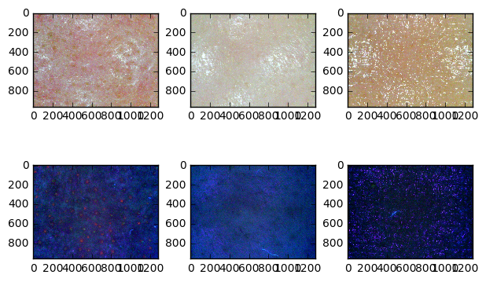
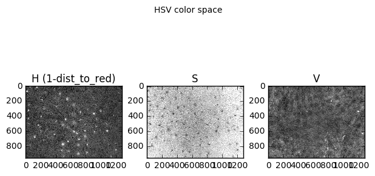
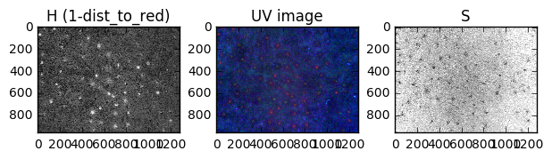

```python
import numpy as np
```


```python
import pickle
```


```python
match_filenames = pickle.load(open('match_filenames.pkl','rb'))
```


```python
import random
```


```python
sample_pairs = random.sample(match_filenames, 3)  # Let's sample 3 random pairs (rgb - uv)
```


```python
import matplotlib.pyplot as plt
```


```python
from skimage.io import imread
```


```python
f_read_pair = lambda x: (imread(x[0]), imread(x[1]))
```


```python
sample_pair_ims = map(f_read_pair, sample_pairs)
```


```python
# Let's look at sample our sample pairs
```


```python
plt.subplot(2,3,1); plt.imshow(sample_pair_ims[0][0]);  # First pair
plt.subplot(2,3,4); plt.imshow(sample_pair_ims[0][1]);
plt.subplot(2,3,2); plt.imshow(sample_pair_ims[1][0]);  # Second pair
plt.subplot(2,3,5); plt.imshow(sample_pair_ims[1][1]);
plt.subplot(2,3,3); plt.imshow(sample_pair_ims[2][0]);  # Third pair
plt.subplot(2,3,6); plt.imshow(sample_pair_ims[2][1]);
```


```python
plt.tight_layout(pad=0, w_pad=0, h_pad=0)
plt.show()
```





```python
# The UV image on the bottom left corner looks like a good example
# Let's analyze that one and check color spaces
```


```python
# Let's look at RGB channels seperately
```


```python
sample_pair = sample_pair_ims[0]
sample_nl = sample_pair[0]  # nl stands for natural light
sample_uv = sample_pair[1]  
```


```python
plt.subplot(1,3,1); plt.imshow(sample_uv[:,:,0], plt.get_cmap('gray')); plt.title('R channel')
plt.subplot(1,3,2); plt.imshow(sample_uv[:,:,1], plt.get_cmap('gray')); plt.title('G channel')
plt.subplot(1,3,3); plt.imshow(sample_uv[:,:,2], plt.get_cmap('gray')); plt.title('B channel')
plt.tight_layout(pad=0, w_pad=0, h_pad=0)
plt.suptitle('RGB channels of the UV image')
plt.show()
```


```python
# As expected R channel has the most information
```


```python
# Let's also look at HSV color space
```


```python
from skimage.color import rgb2hsv
```


```python
# Since hue is a circular quantity, we need a special distance function
# I will implement a function giving its distance to redness center (hue = 0)
```


```python
def __get_hue_dist(h1, h2):
    """
    Returns the distance between two hue values on circle
    :param h1: hue value 1, range:[0,1]
    :param h2: hue value 2, range:[0,1]
    :return: float, hue distance
    """
    # Input check
    assert 0 <= h1 <= 1 and 0 <= h2 <= 1, "Input values must be in the range [0,1]"

    dist_to_zero = lambda x: x if x<=0.5 else 1 - x
    get_half_circle = lambda x: 1 if x<=0.5 else 2

    if get_half_circle(h1) == get_half_circle(h2):
        return abs(h1 - h2)
    else:
        dist = dist_to_zero(h1) + dist_to_zero(h2)
        if dist > 0.5:
            dist = 1 - dist

    return dist

```


```python
# Then the redness function will be:
redness_center = 0
get_redness = lambda h: 1 - __get_hue_dist(h, redness_center)
get_redness_v = np.vectorize(get_redness)
```


```python
# Convert to HSV color space
sample_uv_hsv = rgb2hsv(sample_uv)
```


```python
plt.subplot(1,3,1); plt.imshow(get_redness_v(sample_uv_hsv[:,:,0]), plt.get_cmap('gray')); plt.title('H (1-dist_to_red)');
plt.subplot(1,3,2); plt.imshow(sample_uv_hsv[:,:,1], plt.get_cmap('gray')); plt.title('S')
plt.subplot(1,3,3); plt.imshow(sample_uv_hsv[:,:,2], plt.get_cmap('gray')); plt.title('V')
plt.tight_layout(pad=0, w_pad=0, h_pad=0);
plt.suptitle('HSV color space')
plt.show()
```





```python
# Looks like H and S channels have information about the pores
```


```python
plt.subplot(1,3,1); plt.imshow(get_redness_v(sample_uv_hsv[:,:,0]), plt.get_cmap('gray')); plt.title('H (1-dist_to_red)');
plt.subplot(1,3,2); plt.imshow(sample_uv); plt.title('UV image')
plt.subplot(1,3,3); plt.imshow(sample_uv_hsv[:,:,1], plt.get_cmap('gray')); plt.title('S')
plt.tight_layout(pad=0, w_pad=0, h_pad=0);

plt.show()
```





```python

```
